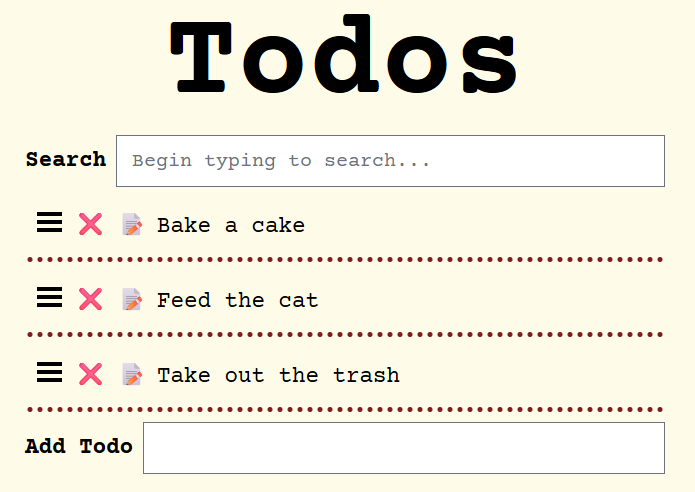

# Todo List Application
Demonstration of a todo list application using:
- [HTMX](https://htmx.org/) : high power tools for HTML
- [GoHT](https://goht.dev/) : a Haml-like type-safe templating language for Go
- [Tailwind CSS](https://tailwindcss.com/) : a utility-first CSS framework



## Originals:
This is a rewrite of some todo list applications that previously demonstrated HTMX:
- Clojure version: https://github.com/ndchorley/todo
- Go version: https://github.com/quii/todo
- My own Templ version: https://github.com/stackus/todos

## Requirements
- [Go](https://golang.org/) 1.19 or later

## Quick Run
```sh
go run .
```

## HTMX
Like the three previous versions, this application uses HTMX to update the UI. In this recreation, the functionality remains mostly the same with only a few minor changes. The use of GoHT and TailwindCSS are the main differences.

### _hyperscript and Sortable.JS
Some additional JavaScript libraries are included to help with the interactivity. I am simply including libraries that the previous Todo applications used as well to keep the functionality the same.

- https://hyperscript.org/
- https://sortablejs.github.io/Sortable/

## GoHT
The [GoHT](https://goht.dev) templating language is used to generate the HTML. This is a Haml-like templating language for Go. The original Go version used the standard library's `html/template` package. The Clojure version used Hiccup. My own Templ version used Templ.

### Installation
```sh
go install github.com/stackus/goht/cmd/goht@latest
```

### Regenerate GoHT templates
```sh
goht generate
```

## Tailwind CSS
Another difference is that all the styling is being handled with TailwindCSS. This is what Node and NPM are used for.

### Requirements
- [Node.js](https://nodejs.org/) 18 or later

### Installation
```sh
npm install
```

### Regenerate TailwindCSS styles
```sh
tailwindcss -i ./assets/tailwind.css -o ./assets/dist/styles.css
```
